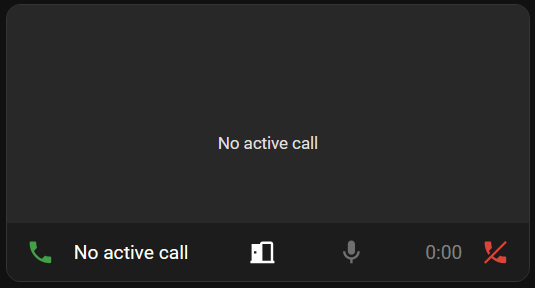

---
tags:
    - Card
---

# Call Card

The call card displays a call interface for SIP Core, without the need for a separate call dialog / popup.\
Also supports being used in a panel view.



## Features

- Manage calls
- Mute mic/video
- Buttons for DTMF and service calls
- Audio visualiser
- Video with camera entity (or SIP video, *experimental*)

## Settings

| Property        | Type      | Description                                         | Example         |
|-----------------|-----------|-----------------------------------------------------|-----------------|
| `extensions`    | [`Extension`](#extension) array  | Map of extensions to show in the card, keyed by extension number | See below |
| `buttons`       | [`Button`](#button) array   | Array of custom buttons to show in the card         | See below |

### Extension

Map of extensions to show in the card, keyed by extension number.

| Property        | Type      | Description                        | Example         |
|-----------------|-----------|------------------------------------|-----------------|
| `name`          | `string`  | Display name for the extension     | `"Front Door"`  |
| `override_icon` | `string`  | Material Design Icon name          | `"mdi:door"`    |
| `camera_entity` | `string`  | Camera entity for video preview    | `"camera.door"` |
| `edit`          | `boolean` | Show edit field to edit the number | `true`          |
| `status_entity` | `string`  | Entity to show the status of the extension. To be used with `state_color` | `"sensor.door_status"` |

:::caution

The default camera entities have a delay. You can use [go2rtc](https://www.home-assistant.io/integrations/go2rtc/) to get a low-latency video feed.

:::

### Button

Array of custom buttons to show in the card. Each button can be a service call or DTMF.

| Property | Type         | Description                                  | Example           |
|----------|--------------|----------------------------------------------|-------------------|
| `label`  | `string`     | Button label                                 | `"Open Door"`     |
| `icon`   | `string`     | Material Design Icon name                    | `"mdi:door"`      |
| `type`   | `ButtonType` | Type of button (`SERVICE_CALL` or `DTMF`)    | `SERVICE_CALL`    |
| `data`   | `any`        | Data for the button (service call or DTMF)   | `{ domain: "light", service: "toggle", entity_id: "light.bedroom_lights" }` or `"1"` |

### Example

```yaml title="Card Configuration"
type: custom:sip-call-card
extensions:
  "101":
    name: Jordy
  "102":
    name: Desk Phone
    override_icon: mdi:deskphone
  "8001":
    name: Doorbell
    camera_entity: camera.doorbell
buttons:
  - label: Open Door
    icon: mdi:door-open
    type: service_call
    data:
      domain: light
      service: toggle
      entity_id: light.bedroom_lights
  - label: DTMF 1
    icon: mdi:1
    type: dtmf
    data:
      dtmf: "1"
```
