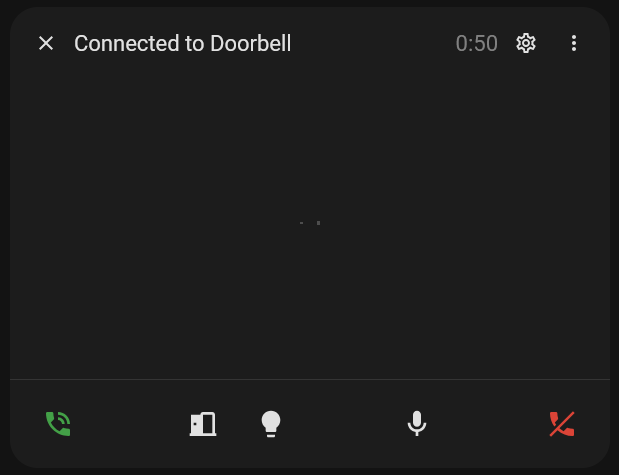

---
tags:
    - Popup
---

# Call Popup

The call popup displays a call interface for SIP Core in a popup dialog.\
Since it is loaded by SIP Core directly, it is always loaded. Even when changing views.

The popup also injects a button into the toolbar, allowing you to open the popup from any dashboard.



## Features

- Manage calls
- Mute mic/video
- Buttons for DTMF and service calls
- Audio visualiser
- Video with camera entity (or SIP video, *experimental*)

## Settings

:::info

This is configured in the `sip-config.json` file, which is loaded by SIP Core.\
You can find more at the [SIP Core Settings](../settings.md) page.

:::

| Property      | Type                                   | Description                                                                 | Example |
| ------------- | -------------------------------------- | --------------------------------------------------------------------------- | ------- |
| `buttons`     | [`Button`][] array                     | Array of custom buttons to show in the popup (service calls or DTMF).       | See below |
| `extensions`  | `{ [key: string]: Extension }`         | Map of extension objects, keyed by extension number.                        | See below |
| `large`       | `boolean`                              | Show the popup in large (fullscreen) mode.                                  | `true` |
| `auto_open`   | `boolean`                              | Automatically open the popup on incoming/outgoing calls.                    | `true` |

<details>
<summary>Full Example</summary>

```json reference title="Popup Options Example"
https://github.com/TECH7Fox/sip-hass-card/blob/main/src/sip-config.json#L32-L62
```

</details>

### Button

| Property | Type         | Description                                  | Example           |
|----------|--------------|----------------------------------------------|-------------------|
| `label`  | `string`     | Button label                                 | `"Open Door"`     |
| `icon`   | `string`     | Material Design Icon name                    | `"mdi:door"`      |
| `type`   | `ButtonType` | Type of button (`SERVICE_CALL` or `DTMF`)    | `SERVICE_CALL`    |
| `data`   | `any`        | Data for the button (service call or DTMF)   | `{ domain: "switch", service: "toggle", entity_id: "switch.door" }` or `"1"` |

```json reference title="Button Example"
https://github.com/TECH7Fox/sip-hass-card/blob/main/src/sip-config.json#L43-L50
```

### Extension

| Property        | Type      | Description                        | Example         |
|-----------------|-----------|------------------------------------|-----------------|
| `name`          | `string`  | Display name for the extension     | `"Front Door"`  |
| `extension`     | `string`  | Extension number                   | `"100"`         |
| `camera_entity` | `string`  | Camera entity for video preview    | `"camera.door"` |

:::caution

The default camera entities have a delay. You can use [go2rtc](https://www.home-assistant.io/integrations/go2rtc/) to get a low-latency video feed.

:::

```json reference title="Extension Example"
https://github.com/TECH7Fox/sip-hass-card/blob/main/src/sip-config.json#L57-L60
```
