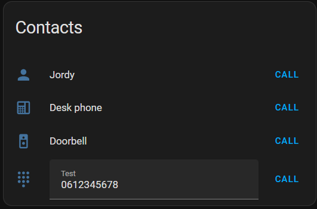

---
tags:
    - Card
---

# Contacts Card

The Contact Card shows a list of SIP endpoints and allows you to call them using SIP Core.



## Features

- Show a list of SIP contacts
- Call SIP contacts
- Edit field for number
- Use custom icons
- Show status of registered entity by using `state_color` and `status_entity`
- Hide the current user from the list
- Debug mode to show debug information in the card

## Settings

| Property        | Type     | Description                        | Example         |
|-----------------|----------|------------------------------------|-----------------|
| `extensions`    | [`Extension`](#extension) array | Map of extensions to show in the card, keyed by extension number | See below |
| `debug`         | `boolean`| Show debug information in the card | `false`         |
| `hide_me`       | `boolean`| Hide the current user from the list | `false`         |
| `state_color`   | `boolean`| Use state color for the card items  | `true`          |

### Extension

Map of extensions to show in the card, keyed by extension number.
| Property        | Type     | Description                        | Example         |
|-----------------|----------|------------------------------------|-----------------|
| `name`          | `string` | Display name for the extension     | `"Front Door"`  |
| `override_icon` | `string` | Material Design Icon name          | `"mdi:door"`    |
| `edit`          | `boolean`| Show edit field to edit the number | `true`          |
| `status_entity` | `string` | Entity to show the status of the extension. To be used with `state_color` | `"sensor.door_status"` |

### Example

```yaml title="Card Configuration"
type: custom:sip-contacts-card
extensions:
  "102":
    name: Jordy
    status_entity: binary_sensor.100_registered
    override_icon: mdi:account
  "103":
    name: Desk phone
    override_icon: mdi:deskphone
  "8001":
    name: Doorbell
    override_icon: mdi:doorbell-video
  "0612345678":
    name: Test
    override_icon: mdi:dialpad
    edit: true
debug: false
hide_me: false
state_color: true
```