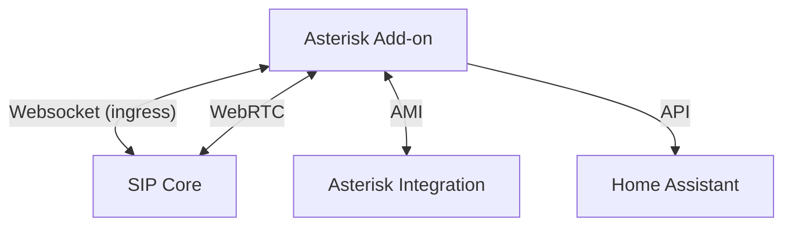

# Introduction

Here is everything you need to setup developing for the add-on.

## Architecture

The Asterisk add-on is a docker container for Home Assistant that set's up a Asterisk server and configures it to use with the card.

It does some extra things besides just running Asterisk.

- Ingress setup
- Preconfigured WebRTC endpoints
- Preconfigured AMI user
- Preinstalled modules like google tts
- And more...



## How to Test

When you have cloned the [repository](https://github.com/TECH7Fox/asterisk-hass-addons), you can test the add-on and your changes in your Home Assistant instance.

- Comment out the `image` option in `config.yaml`.

```yaml title="config.yaml" {6-6}
name: Asterisk
version: 1.3.2
slug: asterisk
description: PBX server for SIP devices like doorbells and phones
url: https://github.com/TECH7Fox/Asterisk-add-on
#image: "ghcr.io/tech7fox/{arch}-addon-asterisk"
arch:
  - armhf
  - armv7
  - aarch64
  - amd64
  - i386
``` 

- Copy the `Asterisk` folder to `/addons`.
- Reload the repositories and install the add-on.
