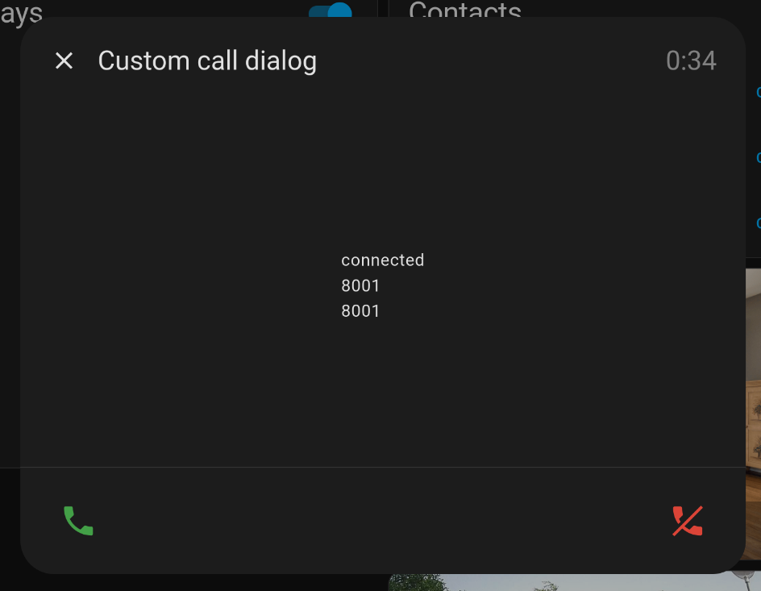

# Custom Popup

This guide will help you create a custom popup that can be used by SIP Core. This popup will interact with the SIP Core instance and provide basic functionality such as answering & ending calls.

:::warning
For this guide we expect you to have **sip-hass-card** already installed, configured and running in your Home Assistant instance. If you haven't done that yet, please refer to the [Installation Guide](/tutorial/introduction.md) to set it up.
:::

## Step 1: Create the Popup
Create a new file named `sip-example-popup.js` in your project directory. This file will contain the code for your standalone popup. Here is a basic example:

<details>
<summary>Example Popup</summary>

This example shows how to create a standalone popup that can be used by SIP Core. It includes basic functionality to interact with the SIP Core instance.

```js
import {
    LitElement,
    html,
    css,
} from "https://cdn.jsdelivr.net/npm/lit-element@4.2.0/+esm";


class SIPExampleDialog extends LitElement {
    sipCore;
    open = false;
    hass = sipCore.hass;
    config = sipCore.config.popup_config;

    constructor() {
        super();
        this.setupButton();

        // bind openPopup and closePopup to this instance
        this.openPopup = this.openPopup.bind(this);
        this.closePopup = this.closePopup.bind(this);
    }

    static get styles() {
        return css`
        ha-icon[slot="meta"] {
            width: 18px;
            height: 18px;
        }

        ha-icon {
            display: flex;
            align-items: center;
            justify-content: center;
        }

        ha-dialog {
            --dialog-content-padding: 0;
            --mdc-dialog-min-width: 600px;
        }

        @media (max-width: 600px), (max-height: 600px) {
            ha-dialog {
                --dialog-surface-margin-top: 0px;
                --mdc-dialog-min-width: calc( 100vw - env(safe-area-inset-right) - env(safe-area-inset-left) );
                --mdc-dialog-max-width: calc( 100vw - env(safe-area-inset-right) - env(safe-area-inset-left) );
                --mdc-dialog-min-height: 100%;
                --mdc-dialog-max-height: 100%;
                --vertical-align-dialog: flex-end;
                --ha-dialog-border-radius: 0;
            }
        }

        .accept-button {
            color: var(--label-badge-green);
        }

        .deny-button {
            color: var(--label-badge-red);
        }

        .deny-button, .accept-button, .audio-button {
            --mdc-icon-button-size: 64px;
            --mdc-icon-size: 32px;
        }

        .row {
            display: flex;
            flex-direction: row;
            justify-content: space-between;
        }

        .bottom-row {
            display: flex;
            justify-content: space-between;
            padding: 12px 16px;
            border-top: 1px solid var(--divider-color);
        }

        .content {
            display: flex;
            justify-content: center;
            align-items: center;
            min-height: 300px;
            width: 100%;
        }

        .form {
            display: flex;
            flex-direction: column;
            padding: 16px;
        }

        ha-select {
            margin: 8px 0;
        }
        `;
    }

    updateHandler = (event) => {
        if (!this.sipCore) {
            this.sipCore = window.sipCore;
        }
        this.requestUpdate();
    }

    connectedCallback() {
        super.connectedCallback();
        window.addEventListener('sipcore-update', this.updateHandler);
        window.addEventListener('sipcore-call-started', this.openPopup);
        window.addEventListener('sipcore-call-ended', this.closePopup);
    }

    disconnectedCallback() {
        super.disconnectedCallback();
        window.removeEventListener('sipcore-update', this.updateHandler);
        window.removeEventListener('sipcore-call-started', this.openPopup);
        window.removeEventListener('sipcore-call-ended', this.closePopup);
    }

    openPopup() {
        this.open = true;
        this.requestUpdate();
    }

    closePopup() {
        this.open = false;
        this.requestUpdate();
    }

    render() {
        if (!this.sipCore) {
            return html`<div>Loading...</div>`;
        }

        return html`
        <ha-dialog ?open=${this.open} @closed=${this.closePopup} hideActions flexContent .heading=${true} data-domain="camera">
        <ha-dialog-header slot="heading">
        <ha-icon-button
        dialogAction="cancel"
        slot="navigationIcon"
        label="Close">
        <ha-icon .icon=${"mdi:close"}></ha-icon>
        </ha-icon-button>
        <div slot="title" class="row">
        <span>Custom call dialog</span>
        <span style="color: gray;">${this.sipCore.callDuration}</span>
        </div>
        </ha-dialog-header>
        <div tabindex="-1" dialogInitialFocus>
        <div class="content">
        ${this.sipCore.callState}
        <br>
        ${this.sipCore.remoteName}
        <br>
        ${this.sipCore.remoteExtension}
        <br>
        ${this.config.test_value}
        </div>
        <div class="bottom-row">
        <ha-icon-button
        class="accept-button"
        label="Answer call"
        @click="${() => this.sipCore.answerCall()}">
        <ha-icon .icon=${"mdi:phone"}></ha-icon>
        </ha-icon-button>
        <ha-icon-button
        class="deny-button"
        label="End call"
        @click="${() => {
            this.sipCore.endCall();
            this.closePopup();
        }}">
        <ha-icon .icon=${"mdi:phone-off"}></ha-icon>
        </ha-icon-button>
        </div>
        </div>
        </ha-dialog>
        `;
    }

    setupButton() {
        const homeAssistant = document.getElementsByTagName("home-assistant")[0];
        const panel = homeAssistant?.shadowRoot?.querySelector("home-assistant-main")
        ?.shadowRoot?.querySelector("ha-panel-lovelace");

        if (panel === null) {
            console.debug("panel not found!");
            return;
        }

        const actionItems = panel?.shadowRoot?.querySelector("hui-root")?.shadowRoot?.querySelector(".action-items");

        if (actionItems?.querySelector("#sipcore-call-button")) {
            return;
        }

        const callButton = document.createElement("ha-icon-button");
        callButton.label = "Open Call Popup";
        const icon = document.createElement("ha-icon");
        icon.style = "display: flex; align-items: center; justify-content: center;";
        icon.icon = "mdi:phone";
        callButton.slot = "actionItems";
        callButton.id = "sipcore-call-button";
        callButton.appendChild(icon);
        callButton.addEventListener("click", () => {
            this.open = true;
            this.requestUpdate();
        });
        actionItems?.appendChild(callButton);

        window.addEventListener("location-changed", () => {
            console.debug("View changed, setting up button again...");
            this.setupButton();
        })
    }
}

customElements.define("custom-call-dialog", SIPExampleDialog);
```
</details>

## Step 2: Load the Popup in Home Assistant

To import this card into Home Assistant, copy the file to your `config/www` directory of your Home Assistant installation. Then, go to settings > dashboards, click on the three dots in the top right corner, and select "Resources". Click on "Add Resource" and enter the path to your popup file, like `/local/sip-example-popup.js`.
Make sure to set the resource type to "JavaScript Module", and then click "Create".

## Step 3: Configure SIP Core to Use the Popup Element

To use your custom popup, you need to configure SIP Core to recognize it. Open your `sip-config.json` file and set the following configuration:

```json
{
    "popup_override_component": "custom-call-dialog",
    "popup_config": {
        "test_value": "This is a test value"
    },
    ... rest of your configuration ...
}
```

This tells SIP Core to use your custom popup component instead of the default one.

Also, SIP Core tries to put the `popup_config` object in your component `config` property, so you can access it in your popup. In this example, we added a `test_value` property to demonstrate how to use it.

Now after saving the configuration and reloading with `Shift+Ctrl+R`, you should be able to see your custom popup in action when you click on the call button in the toolbar or when a call is received.



:::warning
If it is not working for you, check the browser console (F12) for any errors, and make sure it reloaded correctly. You can also try reloading the page with `Shift+Ctrl+R` to force a full reload of HA.
:::

To share your popup with others, you can upload it to a Github repository and use [HACS](https://www.hacs.xyz/docs/publish/plugin/) to make it available for others to install and update easily.

And please share your popup in our [Discord server](https://discordapp.com/invite/qxnDtHbwuD) or on the [Home Assistant Forum](https://community.home-assistant.io/). Would love to see your creations!
