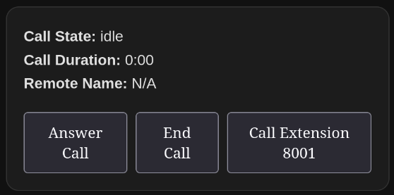

# Simple Card

This guide will help you create a standalone card that can be used in Home Assistant. This card will interact with the SIP Core instance and provide basic functionality such as answering calls, ending calls, and starting calls to specific extensions.

:::warning
For this guide we expect you to have **sip-hass-card** already installed, configured and running in your Home Assistant instance. If you haven't done that yet, please refer to the [Installation Guide](/tutorial/introduction.md) to set it up.
:::

## Step 1: Create the Card
Create a new file named `sip-example-card.js` in your project directory. This file will contain the code for your standalone card. Here is a basic example:

<details>
<summary>Example Card</summary>

This example shows how to create a standalone card that can be used in Home Assistant. It includes basic functionality to interact with the SIP Core instance.

```js
import { LitElement, html, css } from "https://cdn.jsdelivr.net/npm/lit-element@4.2.0/+esm";


class ExampleCard extends LitElement {
    sipCore;

    static styles = css`
        ha-card {
            padding: 16px;
            font-family: Arial, sans-serif;
        }

        .status {
            margin-bottom: 16px;
        }

        .buttons {
            display: flex;
            gap: 8px;
        }

        button {
            padding: 8px 16px;
            font-size: 14px;
            cursor: pointer;
        }
    `;

    connectedCallback() {
        super.connectedCallback();
        window.addEventListener("sipcore-update", this.updateHandler);
    }

    disconnectedCallback() {
        super.disconnectedCallback();
        window.removeEventListener("sipcore-update", this.updateHandler);
    }

    updateHandler = () => {
        if (!this.sipCore) {
            this.sipCore = window.sipCore;
        }
        this.requestUpdate();
    };

    setConfig(config) {
        // Validate the config here
    }

    render() {
        if (!this.sipCore) {
            return html`<div>Loading...</div>`;
        }

        return html`
            <ha-card>
                <div class="status">
                    <strong>Call State:</strong> ${this.sipCore.callState}<br />
                    <strong>Call Duration:</strong> ${this.sipCore.callDuration}<br />
                    <strong>Remote Name:</strong> ${this.sipCore.remoteName || "N/A"}<br />
                </div>
                <div class="buttons">
                    <button @click=${() => this.sipCore.answerCall()}>Answer Call</button>
                    <button @click=${() => this.sipCore.endCall()}>End Call</button>
                    <button @click=${() => this.sipCore.startCall("8001")}>Call Extension 8001</button>
                </div>
            </ha-card>
        `;
    }
}

customElements.define("sip-example-card", ExampleCard);
window.customCards = window.customCards || [];
window.customCards.push({
    type: "sip-example-card",
    name: "SIP Example Card",
    preview: true,
    description: "SIP Example Card",
});
```
</details>

## Step 2: Load the Card in Home Assistant

To import this card into Home Assistant, copy the file to your `config/www` directory of your Home Assistant installation. Then, go to settings > dashboards, click on the three dots in the top right corner, and select "Resources". Click on "Add Resource" and enter the path to your card file, like `/local/sip-example-card.js`.
Make sure the resource type is set to "JavaScript Module", and then click "Create".

## Step 3: Add the Card to Your Dashboard

Now you can add the card to your dashboard. Go to your dashboard, click on the three dots in the top right corner, and select "Edit Dashboard". Click on "Add Card", then select "Manual" and enter the following configuration:

```yaml
type: "custom:sip-example-card"
```

Now you should see your custom card in your dashboard, which can interact with the SIP Core instance.



:::warning
If it is not working for you, check the browser console (F12) for any errors, and make sure it reloaded correctly. You can also try reloading the page with `Shift+Ctrl+R` to force a full reload of HA.
:::

To share your card with others, you can upload it to a Github repository and use [HACS](https://www.hacs.xyz/docs/publish/plugin/) to make it available for others to install and update easily.

And please share your card in our [Discord server](https://discordapp.com/invite/qxnDtHbwuD) or on the [Home Assistant Forum](https://community.home-assistant.io/). Would love to see your creations!
