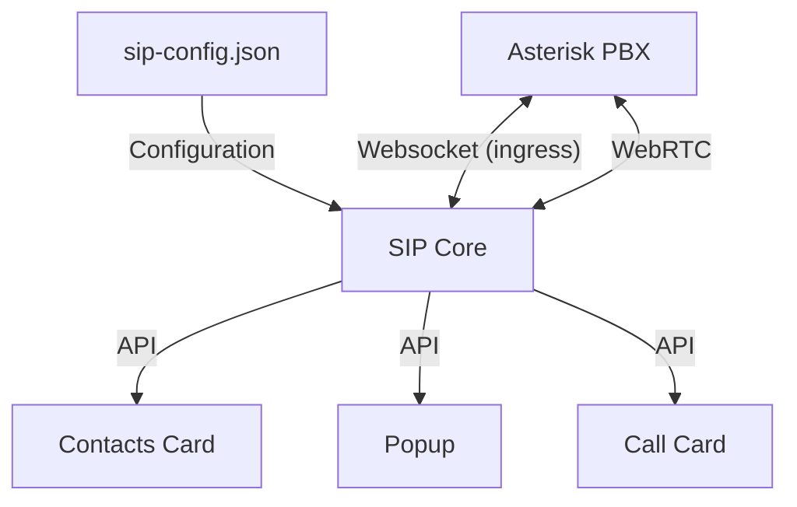

# Introduction

The SIP Core component is designed as a modular call management system for third party cards and developers to use.

:::info
This documentation is for the latest version of [sip-hass-card](https://github.com/TECH7Fox/sip-hass-card).\
Older versions are not supported and may not work with the latest Home Assistant versions.
:::

## Architecture

SIP Core is directly loaded in the Home Assistant frontend. This allows it to work on every page, and not just the dashboard.
It provides an API for cards and other elements to interact with SIP calls, manage call states, and handle user interactions.

:::warning
The Home Assistant ingress is only available when using
the Asterisk add-on. If you are using a standalone Asterisk server,
you will need to set up your own port forwarding, SSL, etc.
:::

The SIP Core instance is also mounted on the `window` object, allowing easy access from custom cards and components without needing to import it directly.
You can access it using `window.sipCore` in your JavaScript code.

## SIP Core API Documentation

For detailed information on the SIP Core API with all available methods, properties and enums, please refer to the [SIP Core API documentation](api). This documentation is directly generated from the main branch of the SIP Core codebase.

## Contributing

PRs and contributions for SIP Core and even wide-use cards / popups are always welcome!

If there are a lot of popular custom cards or popups,
I might create a seperate community repository for them so people can easily
find and install different cards and popups to use with SIP Core.

## Getting Started

To get started with developing your own SIP card, you can follow the [SIP Card Development Guide](guides/standalone.md). This guide will walk you through the process of creating a custom SIP card, including setting up your development environment, creating the card, and integrating it with SIP Core.

There is also a guide for creating a popup and overriding the default one, which can be found in the [Popup Development Guide](guides/popup.md).

:::info
I would love to showcase your custom cards and popups in the documentation, so please share them with me on our [Discord server](https://discordapp.com/invite/qxnDtHbwuD) or on the [Home Assistant Forum](https://community.home-assistant.io/).
:::
