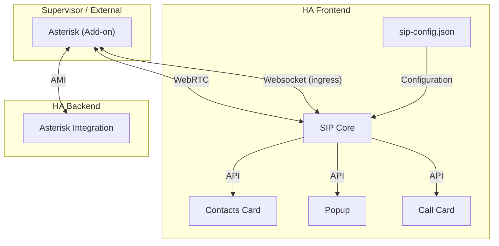

# Wide Architecture

This section explains the entire architecture of all SIP-HASS components and how they work together.

This includes:
- SIP Core
- SIP Cards (Contacts, Call, Popup, third-party)
- Asterisk Integration
- Asterisk Add-on

## Asterisk

Asterisk is the PBX that handles the actual calls, SIP endpoints, etc.
Other PBXes will not work, since Asterisk is currently the only PBX
that supports WebRTC translation that I know of.

I did try to make a FreePBX add-on, since it it pretty much just
a manager and web interface for Asterisk, but they add so much
overhead and complexity that not only is impossible to maintain
for a container, but also has multiple bugs that make it unusable
for this project.

See the [Asterisk Add-on](/developers/add-on.md) section for more information.

## SIP Core

SIP Core is the main component that handles all call management
and communication to Asterisk. It provides an API for cards and other elements to use.

See the [SIP Core](/developers/card/introduction.md) section for more information.

## Asterisk Integration

The Asterisk integration is a custom component that connects to the Asterisk Manager Interface (AMI) and provides sensors and services for managing calls and endpoints.

This integration is optional and not required to use the SIP Core or cards, but it provides additional functionality and integration with Home Assistant.

See the [Asterisk Integration](/developers/integration/integration.md) section for more information.
