# Understanding SIP for Home Assistant

Before diving into the setup, let's understand what SIP is and why it's useful for your Home Assistant setup.

## Session Initiation Protocol (SIP)

**SIP** (Session Initiation Protocol) is a communication protocol used for initiating, maintaining, and terminating real-time communication sessions. These sessions can include:

- **Voice calls** (like traditional phone calls)
- **Video calls** (like video conferencing)
- **Instant messaging** and presence information

Think of SIP as the "language" that devices use to establish and manage calls over IP networks (the internet or your local network).

## Why SIP in Home Assistant?

SIP brings powerful communication capabilities to your smart home:

### 🔔 **Doorbell Integration**
- Connect SIP-enabled doorbells and intercoms
- Receive calls when someone rings your doorbell
- Answer calls directly from your Home Assistant dashboard
- View video feeds from door cameras

### 📞 **Internal Communication**
- Set up an internal "phone system" in your home
- Call between different rooms or devices
- Create a whole-home intercom system

### 🏠 **Smart Home Automation**
- Trigger automations when calls are received or made
- Integrate call states with other smart home devices
- Use voice announcements for notifications

### 🎤 **Voice Assistant Integration**
- Make calls using Home Assistant voice assistants
- Voice-activated dialing ("Hey Assistant, call the front door")
- Hands-free communication through smart speakers
- Integrate SIP calling with existing voice automation workflows

## Key Concepts

### PBX (Private Branch Exchange)
A **PBX** is like a mini phone system for your home or business. It manages all the SIP devices and routes calls between them. In SIP-HASS, we use **Asterisk** as our PBX software.

### WebRTC
**WebRTC** (Web Real-Time Communication) allows voice and video calls directly in your web browser. This is what makes it possible to make calls from your Home Assistant dashboard without installing special software.

### WebSocket (WS/WSS)
**WebSockets** provide real-time, bidirectional communication between your browser and Home Assistant. **WSS** (WebSocket Secure) adds encryption for secure communication. These are essential for live call features like:
- Real-time call status updates
- Live audio/video streaming
- Instant call notifications and controls

### SIP Endpoints
An **endpoint** is any device that can make or receive SIP calls, such as:
- SIP doorbells
- IP phones  
- Software clients (like apps)
- The SIP cards in Home Assistant

## How SIP-HASS Works

```mermaid
flowchart TB
    A[SIP Doorbell] <--> B[Asterisk PBX]
    C[IP Phone] <--> B
    B <--> D[Ingress Add-on]
    D <--> E[SIP Integration]
    E --> F[SIP Cards]
    F --> G[Dashboard]
    F --> H[Mobile App]
    E --> I[Automations]
```

1. **SIP devices** (like doorbells) connect to the **Asterisk PBX**
2. The **Ingress Add-on** provides secure communication between Asterisk and Home Assistant
3. The **SIP Integration** in Home Assistant processes call events and states
4. **SIP Cards** on your dashboard provide the user interface for calls
5. **Automations** can respond to call events and trigger smart home actions

## Real-World Example

Imagine you have a SIP doorbell at your front door:

1. **Someone rings the doorbell** → The doorbell sends a SIP call to Asterisk
2. **Asterisk notifies the Integration** → Home Assistant knows there's an incoming call
3. **Call popup appears** → You see who's at the door via SIP cards on your dashboard
4. **You answer the call** → You can talk to the visitor and see video (if supported)
5. **Automation triggers** → Maybe turn on porch lights or unlock the door

This all happens using standard SIP protocols, making it compatible with a wide range of devices from different manufacturers.

---

Now that you understand what SIP is and how it fits into your Home Assistant setup, let's move on to installing the components you'll need!